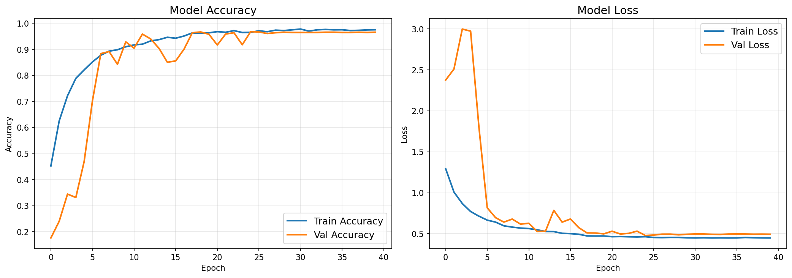
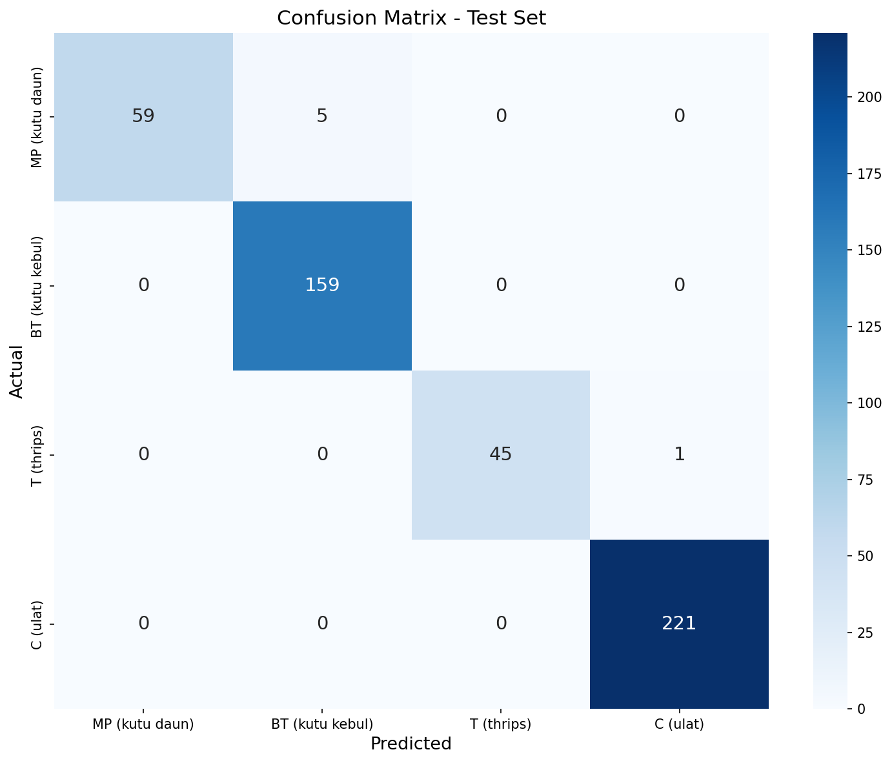

# Red Chili Pepper Pests

## Ringkasan

Deskripsi singkat: proyek ini menyediakan dataset dan panduan untuk klasifikasi gambar hama tanaman cabe merah. Dataset asli didistribusikan dalam format anotasi YOLO (file teks per gambar), namun implementasi dalam repo ini menggunakan pendekatan klasifikasi gambar — setiap gambar diperlakukan memiliki satu label kelas di antara 4 kelas berikut: MP (Kutu Daun / Aphid), BT (Kutu Kebul / Whitefly), T (Thrips), dan C (Ulat / Caterpillar).


## Konten Utama Repositori
- **Dataset:** [indraagustian/red-chili-pepper-pests-dataset](https://www.kaggle.com/datasets/indraagustian/red-chili-pepper-pests-dataset) — dataset berlisensi Apache License 2.0 (lihat https://www.apache.org/licenses/LICENSE-2.0).
- **Notebook:** [notebooks/red_chili_pepper_pests_model.ipynb](notebooks/Template_Submission_Akhir.ipynb) — template eksperimen (preprocessing, pelatihan, evaluasi, ekspor, inferensi).
- **Model hasil:** direktori `save_model/`, `tflite/`, dan `tfjs_model/` menyimpan model yang diekspor.

## Struktur Dataset
- `datasets/RedChiliPepperPestsDataset/train/images/` — gambar latih
- `datasets/RedChiliPepperPestsDataset/train/labels/` — file label/anotasi (lihat catatan di bawah)
- `datasets/RedChiliPepperPestsDataset/val/` — data validasi
- `datasets/RedChiliPepperPestsDataset/test/` — data uji


## Catatan Anotasi / Konversi ke Klasifikasi
- Dataset sumber menggunakan format YOLO (setiap file `.txt` berisi satu atau beberapa baris bounding-box: `<class_id> <x_center> <y_center> <width> <height>`).
- Karena pendekatan di repo ini adalah klasifikasi gambar (satu label per gambar), notebook mengambil kelas utama dari file label untuk menentukan label gambar. Periksa [notebooks/red_chili_pepper_pests_model.ipynb](notebooks/Template_Submission_Akhir.ipynb) untuk logika persisnya (mis. memilih kelas pertama atau kelas dengan bounding-box terbesar).

## Daftar Kelas
- `0` : MP — Kutu Daun (Aphid)
- `1` : BT — Kutu Kebul (Whitefly)
- `2` : T  — Thrips
- `3` : C  — Ulat (Caterpillar)
  


## Setup (Menggunakan `uv`)

1. Jika belum terpasang, pasang `uv` (menggunakan `pip`):

```bash
pip install uv
```

2. Inisialisasi proyek dan lingkungan dengan `uv`:

```bash
uv init
```

3. Ikuti instruksi yang ditampilkan oleh `uv` untuk mengaktifkan lingkungan dan memasang dependensi (workspace ini menggunakan `requirements.txt`).

Alternatif (tanpa `uv`): buat virtual environment manual dan pasang dependensi:

```bash
python3 -m venv .venv
source .venv/bin/activate
pip install --upgrade pip
pip install -r requirements.txt
```

## Menjalankan Notebook

Buka notebook dan jalankan sel bertahap:

```bash
jupyter notebook notebooks/red_chili_pepper_pests_model.ipynb
```

Notebook berisi langkah-langkah: pra-pemrosesan gambar, pembagian dataset (jika perlu), pelatihan model, evaluasi (akurasi / confusion matrix), dan ekspor model (SavedModel, TFLite, TFJS).

## Hasil Evaluasi Model

### Training History (Accuracy & Loss)



### Confusion Matrix (Test Set)



Ringkasan cepat dari confusion matrix di atas:
- Prediksi benar: `484/489` sampel (akurasi sekitar `98.98%`).
- Kesalahan utama: `5` sampel `MP` diprediksi sebagai `BT`.
- Kesalahan minor: `1` sampel `T` diprediksi sebagai `C`.

## Lokasi Model Hasil dan Inferensi
- Model TensorFlow (SavedModel): `save_model/`
- Model TFLite: `tflite/`
- Model TFJS: `tfjs_model/`

Untuk inferensi cepat menggunakan TFLite (contoh):

```python
import tflite_runtime.interpreter as tflite
interpreter = tflite.Interpreter(model_path='tflite/model.tflite')
interpreter.allocate_tensors()
# lihat notebook untuk pipeline preprocessing dan postprocessing
```

## Catatan Penting
- Dataset asli mungkin diunggah dalam `datasets/archive.zip`. Pastikan mengekstrak ke `datasets/RedChiliPepperPestsDataset/` sebelum menjalankan notebook.
- Beberapa folder mungkin mengandung file `desktop.ini` — itu bukan bagian dataset dan bisa diabaikan atau dihapus.

## Kredit & Lisensi
- Dataset: [indraagustian/red-chili-pepper-pests-dataset](https://www.kaggle.com/datasets/indraagustian/red-chili-pepper-pests-dataset) — Apache License 2.0 (https://www.apache.org/licenses/LICENSE-2.0).
- Penulis / kontributor: Bagus Alfiyan Yusuf.
- Lisensi repositori: [Apache License 2.0](/LICENSE).


## Kontak / Kontribusi
- Jika Anda ingin menambah data, memperbaiki anotasi, atau meningkatkan model, silakan ajukan pull request atau buka issue di repo ini.

---
_Dokumentasi ini dibuat otomatis sebagai ringkasan; beri tahu jika Anda mau versi bahasa Inggris atau penjelasan teknis lebih rinci tentang notebook dan model._
